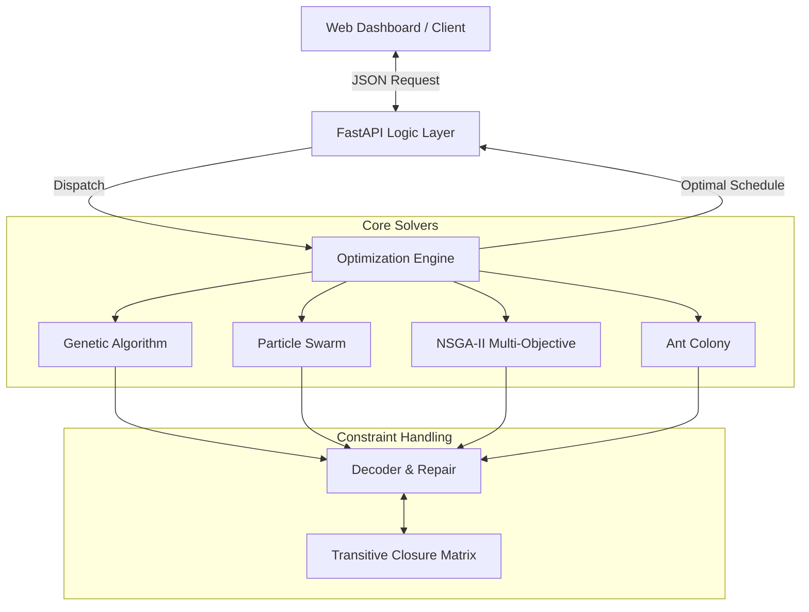

# 智慧製造排程與拆解優化系統 (Intelligent Manufacturing Scheduling & Disassembly Optimization System)
> **基於學術研究的 NP-Hard 製造排程問題解決方案**


## 📖 研究背景與動機 (Motivation)
本專案源自於我在學期間的**碩士論文研究**，旨在解決製造業中經典且極具挑戰性的 **NP-Hard** 問題——**裝配線平衡問題 (Assembly Line Balancing Problem, ALBP)** 以及**選擇性拆解規劃 (Selective Disassembly Planning)**。

在實際生產環境中，如何在嚴格的**優先順序限制 (Precedence Constraints)** 下，最大化產線效率、最小化碳足跡並同時考量利潤，是一個極其複雜的多目標優化問題。本專案將我論文中的理論演算法轉化為可執行的 Python 引擎，驗證了其在複雜限制下的求解能力。

---

## 🔬 演算法設計與核心技術 (Algorithm Design)

本系統完全**從零實作 (From Scratch)** 了多種元啟發式演算法，並針對排程問題的特性進行了深度的客製化改良。重點不在於呼叫函式庫，而在於**編碼策略 (Encoding)** 與**運算子設計 (Operator Design)**。

### 1. 限制條件處理 (Constraint Handling)
*   **傳遞閉包矩陣 (Transitive Closure Matrix)**: 為了確保所有生成的排程都嚴格符合「工序 A 必須在工序 B 之前」的物理限制，我預先計算了所有工序的依賴關係矩陣，並在演算法生成解的過程中即時修復，保證解的可行性。

### 2. 單目標演算法：裝配線平衡 (Single-Objective: Line Balancing)
針對裝配線平衡問題 (ALBP)，目標是**最小化工作站數量 (Minimizing Workstations)** 或 **最小化循環時間 (Cycle Time)**。

| 演算法 (Algorithm) | 核心技術與改良 (Key Contributions) | 適用場景 |
| :--- | :--- | :--- |
| **遺傳演算法 (GA)** | • **雙點交配 (Two-Point Crossover)** 結合修復機制<br>• **排序選擇 (Rank Selection)** 避免早熟收斂 | 組合優化問題的通用首選，全域搜尋能力強。 |
| **粒子群演算法 (PSO)** | • **SPV (Smallest Position Value)** 規則：將連續的粒子速度向量映射為離散的工序排列<br>• 動態慣性權重調整 | 驗證連續型演算法在離散問題上的映射效率。 |
| **蟻群演算法 (ACO)** | • **輪盤法 (Roulette Wheel)** 建構路徑<br>• 費洛蒙更新機制模擬工序順序的加強 | 適用於路徑依賴性強的順序決策問題。 |
| **模擬退火 (SA)** | • **Metropolis 準則** 接受劣解<br>• 溫度冷卻排程控制收斂速度 | 避免陷入區域最佳解，結構簡單且強健。 |

### 3. 多目標演算法：選擇性拆解 (Multi-Objective: Disassembly)
針對選擇性拆解規劃 (Selective Disassembly Planning)，需同時考量**最大化利潤 (Profit)** 與 **最小化碳足跡 (Carbon Footprint)**。

| 演算法 (Algorithm) | 核心技術與改良 (Key Contributions) | 適用場景 |
| :--- | :--- | :--- |
| **NSGA-II** | • **非凌駕排序 (Non-Dominated Sorting)**<br>• **擁擠距離 (Crowding Distance)** 計算<br>• **Pareto Front** 求解 | 尋求多個目標間的最佳權衡解 (Trade-off Solutions)。 |
| **PSO + PPX Hybrid** | • 結合 PSO 快速收斂與 PPX (Precedence Preserving Crossover) 的結構保留特性 | 在論文實驗中取得了優於傳統 NSGA-II 的 HV 分數。 |
| **非線性 PSO (NPSO)** | • 引入非線性慣性權重與學習因子<br>• 同時優化利潤與碳排 | 針對高維度複雜問題的改良策略。 |
| **區塊遺傳 (BlockGA)** | • 將染色體分塊演化<br>• 針對區域結構特徵進行局部搜索 | 適用於具有模組化特徵的排程問題。 |
| **K&G Algorithm** | • 經典的拆解規劃啟發式演算法<br>• 作為效能比較的 Baseline | 用於驗證新演算法在多目標拆解問題上的優越性。 |

---

## � 研究成果與驗證 (Results & Validation)

本系統將 MATLAB 原始研究代碼移植至 Python 後，經過大量測試數據驗證：
1.  **收斂性驗證**: 透過動態圖表 (Convergence Plot) 證明各演算法隨著代數增加，Fitness Value 呈現穩定的下降（或上升）趨勢。
2.  **Pareto 最優解**: 在多目標問題中，成功找出一組**互不隸屬 (Non-Dominated)** 的解集合，提供決策者多樣化的選擇（如：犧牲少量利潤換取大幅碳排減少）。
3.  **基準測試**: 包含 NSGA-II (Standard), NSGA-II (Baseline), PSO-PPX 等多種配置的性能比較。

*(原始 MATLAB 研究代碼保留於 `matlab_legacy/` 目錄中，以供學術查證。)*

---

## 💻 系統架構與展示 (System Architecture)

為了便於展示與即時測試演算法效能，我構建了一個輕量級的 Web 介面。**請注意，Web 僅作為「演算法的視覺化載體」，本專案的核心價值在於後端的求解引擎。**

*   **Backend**: Python (FastAPI) - 負責執行複雜的數學運算與演算法迭代。
*   **Frontend**: HTML/JS/Chart.js - 負責將透過 API 回傳的數據轉化為收斂曲線與 Pareto 分佈圖。

### 1. 系統流程圖 (System Workflow)



### 2. 專案結構 (Project Directory)

```bash
.
├── main.py                 # 系統進入點 (System Entry Point)
├── app/
│   ├── routers/            # API 路由定義 (API Endpoints)
│   └── utils/              # 資料轉換與輔助工具
├── solvers/                # 核心演算法邏輯 (Core Algorithms)
│   ├── problem_data.py     # 問題資料定義 (Problem Data Definitions)
│   ├── single_objective/   # 單目標演算法 (Single-Objective)
│   │   ├── ga_solver.py
│   │   ├── pso_solver.py
│   │   ├── aco_solver.py
│   │   └── ...
│   └── multi_objective/    # 多目標演算法 (Multi-Objective)
│       ├── nsga2_solver.py
│       ├── block_ga_solver.py
│       └── pso_ppx_solver.py
├── scripts/                # 獨立測試腳本 (Standalone Scripts)
├── data/                   # 設定檔與測試資料 (Config & Datasets)
├── docs/                   # 演算法詳細說明文件
├── matlab_legacy/          # 原始研究代碼 (Original Research Code)
└── static/                 # 前端介面資源 (Frontend Assets)
```


### 快速開始 (Quick Start)

```bash
# 安裝依賴
pip install -r requirements.txt

# 啟動系統
python main.py
```

*   **排程優化展示**: 瀏覽 `http://localhost:8000/scheduler`
*   **多目標拆解展示**: 瀏覽 `http://localhost:8000/static/disassembly.html`

---
*Created by [Jun] - 2025*
